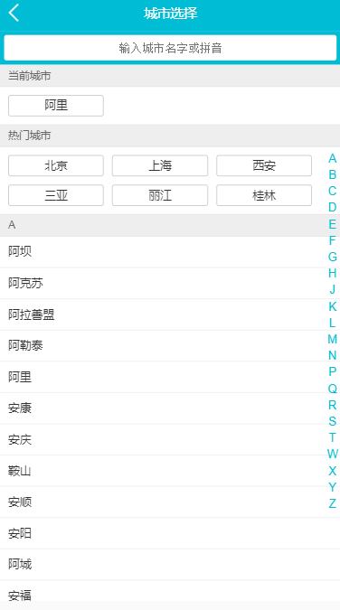

# travel

> 一个基于vue的移动端项目

## Build Setup

``` bash
# install dependencies
npm install

# serve with hot reload at localhost:8080
npm run dev

# build for production with minification
npm run build

# build for production and view the bundle analyzer report
npm run build --report
```

For a detailed explanation on how things work, check out the [guide](http://vuejs-templates.github.io/webpack/) and [docs for vue-loader](http://vuejs.github.io/vue-loader).
# 项目结构
```
+---.history
|   +---config
|   +---src
|   |   +---assets
|   |   |   \---styles
|   |   +---pages
|   |   |   +---city
|   |   |   |   +---component
|   |   |   |   \---components
|   |   |   \---home
|   |   |       \---components
|   |   +---router
|   |   \---store
|   \---static
|       \---local
+---.idea
+---build
+---config
+---src
|   +---assets
|   |   \---styles
|   |       \---iconfont
|   +---pages
|   |   +---city
|   |   |   \---components
|   |   +---detail
|   |   |   \---components
|   |   \---home
|   |       \---components
|   +---public
|   |   +---fade
|   |   \---gallary
|   +---router
|   \---store
\---static
    \---local
```

# 首页图

# 城市选择

# 推荐详情

# 详情画廊

# License
Vuetify is [MIT licensed](https://github.com/vuetifyjs/vuetify/blob/master/LICENSE.md "MIT").